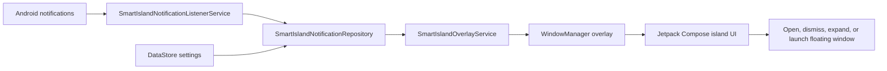

<h1 align="center">Smart Island</h1>

<p align="center">
  A lightweight Android overlay that turns notifications, calls, and media playback into a floating glanceable island.
</p>

<p align="center">
  
  
  
  
  
</p>

<p align="center">
  <a href="#downloads--safety">Downloads</a> |
  <a href="#features">Features</a> |
  <a href="#getting-started">Getting Started</a> |
  <a href="#privacy-and-permissions">Privacy</a> |
  <a href="#contributing">Contributing</a>
</p>

---

## Overview

Smart Island is an open-source Android app that adds a small animated pill near the status bar. It listens for notification events locally, groups active items, and expands into a richer view for quick actions, media details, incoming calls, and notification previews.

The project is designed to be transparent, hackable, and privacy-conscious: notification data is processed on the device, settings are stored locally, and the app currently does not request the Android `INTERNET` permission.

## Downloads & Safety

* **Download APK**: Obtain the pre-compiled application package directly from the [GitHub Releases (Latest)](https://github.com/agupta07505/SmartIsland/releases/latest) page.
* **Total Downloads**: 
* **Security Verification**: To ensure transparency and safety, you can inspect the files using [VirusTotal](https://www.virustotal.com) or review the automatic building and packaging logs under the GitHub Actions tab.

## Screenshots

<p align="center">
  
  
  
</p>

## Features

| Area | What Smart Island does |
| --- | --- |
| Floating overlay | Draws a compact island above other apps using Android's overlay window APIs. |
| Notification listener | Converts active notifications into glanceable island cards. |
| Smooth animation | Morphs between collapsed and expanded states with Compose animations. |
| Multiple notifications | Keeps a stack of active notifications and lets users move between them. |
| Calls and media | Detects incoming calls, music/media sessions, artwork, playback state, and progress. |
| Battery charging | Displays charging percentage, pulsing charging icon, and remaining charge time estimates. |
| Quick actions | Opens, dismisses, or launches supported notification content from the expanded island. |
| Custom controls | Lets users adjust width, height, position, and corner radius. |
| Local settings | Persists island preferences with AndroidX DataStore Preferences. |
| Demo modes | Includes notification, call, music, and battery charging demo buttons for quick testing. |

## Architecture



## Tech Stack

| Layer | Tools |
| --- | --- |
| Language | Kotlin |
| UI | Jetpack Compose, Material 3 |
| Android services | `NotificationListenerService`, foreground service, `WindowManager` overlay |
| State and storage | Kotlin coroutines, StateFlow, AndroidX DataStore Preferences |
| Build | Gradle Wrapper, Android Gradle Plugin, JVM 17 |

## Requirements

- Android Studio with Android SDK 36 installed
- JDK 17
- Android device or emulator running Android 8.0+ (`minSdk 26`)
- Overlay permission enabled on the test device
- Notification listener access enabled for Smart Island

## Getting Started

Clone the repository:

```bash
git clone https://github.com/agupta07505/SmartIsland.git
cd SmartIsland
```

Build a debug APK on Windows:

```powershell
.\gradlew.bat assembleDebug
```

Build a debug APK on macOS or Linux:

```bash
./gradlew assembleDebug
```

Install the debug build on a connected device:

```bash
./gradlew installDebug
```

Then open Smart Island and complete the runtime setup:

1. Grant overlay permission.
2. Enable notification listener access.
3. Turn on Smart Island from the app.
4. Use the demo buttons or trigger real notifications to test the island.

## Privacy And Permissions

Smart Island needs powerful Android permissions because it is an overlay and notification experience. The project keeps that behavior visible and local.

| Permission | Why it is used |
| --- | --- |
| `SYSTEM_ALERT_WINDOW` | Draws the floating island above other apps. |
| `BIND_NOTIFICATION_LISTENER_SERVICE` | Reads notification metadata so the island can show notification, call, and media states. |
| `FOREGROUND_SERVICE` and `FOREGROUND_SERVICE_SPECIAL_USE` | Keeps the overlay service running while the island is enabled. |

At the time of this README, the app does not request `INTERNET`, does not include analytics, and does not send notification content to a remote server. See [PRIVACY.md](PRIVACY.md) for the full privacy note.

## Project Structure

```text
SmartIsland/
|-- app/
|   `-- src/main/
|       |-- AndroidManifest.xml
|       |-- java/com/agupta07505/smartisland/
|       |   |-- data/       # Settings model and DataStore repository
|       |   |-- model/      # Island notification and mode models
|       |   |-- service/    # Overlay and notification listener services
|       |   |-- ui/         # Compose screens and island components
|       |   `-- MainActivity.kt
|       `-- res/
|-- gradle/
|-- build.gradle.kts
|-- settings.gradle.kts
`-- README.md
```

## Development Notes

- Use the Gradle Wrapper committed in this repository.
- Keep secrets, keystores, local SDK paths, generated APKs, and personal notification screenshots out of git.
- Test overlay behavior on a physical device when possible; OEM Android builds can handle overlay and background-service rules differently.
- Some floating-window behavior depends on Android version and device support.
- The pass-through touch region and freeform "open in floating window" gesture rely on best-effort platform APIs and may be unavailable on some devices/OEM Android builds.
- For signed GitHub Actions releases, see [docs/RELEASE_SIGNING.md](docs/RELEASE_SIGNING.md).

## Contributing

Contributions are welcome. Please read [CONTRIBUTING.md](CONTRIBUTING.md) before opening a pull request, and use the issue templates for bug reports or feature ideas.

By contributing, you agree that your contribution will be licensed under the same GNU General Public License v3.0 terms as the project.

## Security

Please report suspected vulnerabilities responsibly. See [SECURITY.md](SECURITY.md) for the reporting process and what information to include.

## License

Smart Island is licensed under the [GNU General Public License v3.0](LICENSE).

Copyright (C) 2026 Animesh Gupta.
