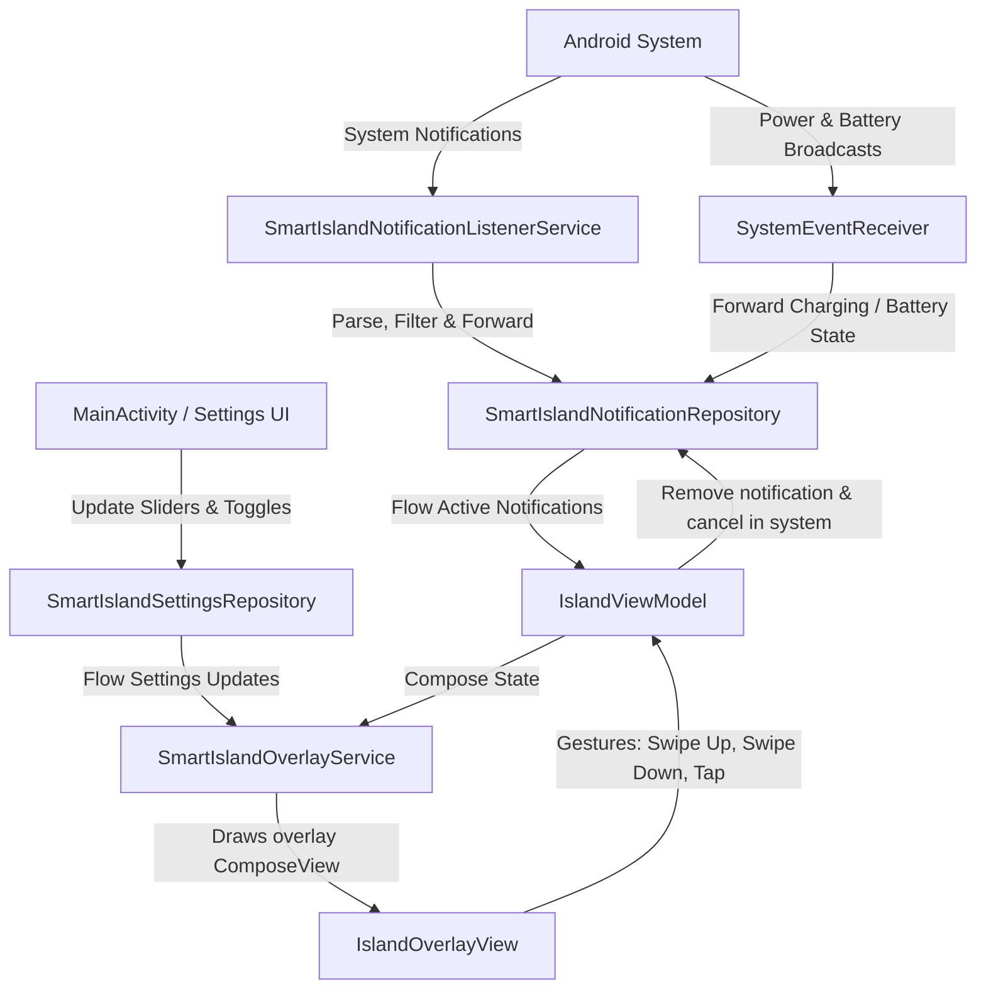

# Smart Island - Codebase & Architecture Analysis

This document presents a comprehensive, technical deep-dive into the architecture, design, and implementation of the **Smart Island** Android application, utilizing metadata gathered and verified via the `codebase-memory-mcp` tools.

---

## 1. System Architecture

The application is structured around a reactive, unidirectional data flow (UDF) that links Android system events (notifications, battery state changes) to a persistent Jetpack Compose overlay window drawn over other applications.

### Architectural Diagram

---

## 2. Core Service Components & Key Mechanisms

### 2.1. Notification Listener & Classification
* **Class:** [SmartIslandNotificationListenerService](file:///a:/SmartIsland/app/src/main/java/com/agupta07505/smartisland/service/SmartIslandNotificationListenerService.kt)
* **Mechanism:**
  * **System Interception:** Intercepts incoming notifications by extending Android's `NotificationListenerService`.
  * **System Tray Suppression:** If an incoming notification is classified as `IMPORTANCE_HIGH` (Heads-Up notification), the service calls `cancelNotification(sbn.key)` to suppress the default OS banner. Simultaneously, it posts the notification to the Smart Island overlay with `autoExpand = true` to mimic a heads-up animation.
  * **Suppressed Keys Set:** Maintains a local `suppressedKeys` set to handle the cancellation sync so that notifications are not accidentally removed from the overlay state during the self-cancellation process.
  * **Classification Logic:** Uses [NotificationFilter](file:///a:/SmartIsland/app/src/main/java/com/agupta07505/smartisland/util/NotificationFilter.kt) to filter out system-level package alerts, empty notifications, and ongoing foreground tasks (unless they represent calls, music playback, or progress tasks). It categorizes notifications into one of the `IslandMode` categories:
    * `Notification.CallStyle` / `Notification.CATEGORY_CALL` $\rightarrow$ `IslandMode.IncomingCall`
    * `Notification.CATEGORY_TRANSPORT` or notifications with media controllers/action labels $\rightarrow$ `IslandMode.Music`
    * Ongoing progress $\rightarrow$ `IslandMode.Music` / `IslandMode.Notification` (context dependent)
    * Charging $\rightarrow$ `IslandMode.Battery`
    * General notifications $\rightarrow$ `IslandMode.Notification`
  * **Media Session Binding:** Inspects the notification extras for `Notification.EXTRA_MEDIA_SESSION`. If found, it establishes a `MediaController` connection to track play/pause states, position estimation, and metadata (title, artist, album artwork).

### 2.2. Compose Overlay Lifecycle Management
* **Class:** [SmartIslandOverlayService](file:///a:/SmartIsland/app/src/main/java/com/agupta07505/smartisland/service/SmartIslandOverlayService.kt)
* **Mechanism:**
  * **Application Overlay Window:** Inflates and manages a custom `ComposeView` drawn on the window manager using the `TYPE_APPLICATION_OVERLAY` flag.
  * **Overlay View Tree Owners:** Attaches custom Lifecycle, ViewModel, and SavedStateRegistry owners defined in [OverlayViewTreeOwners](file:///a:/SmartIsland/app/src/main/java/com/agupta07505/smartisland/service/OverlayViewTreeOwners.kt) directly to the window-hosted `ComposeView`. This enables Jetpack Compose components and animations to run safely within the Service context without throwing standard runtime Activity missing context exceptions.

### 2.3. Touch Pass-Through & Reflection Workaround
The overlay window must not block touch events directed at underlying background apps (e.g. scrolling in Chrome, typing on a keyboard) when the island is collapsed.
* **Mechanism:**
  * **Frame vs. Region Insets:**
    * **Expanded State:** The layout params are updated to allow touch capturing across the full frame (`TOUCHABLE_INSETS_FRAME`) so that tapping outside the expanded island collapses the island.
    * **Collapsed State:** Uses `TOUCHABLE_INSETS_REGION` (integer value `3`). It registers a reflection-based `OnComputeInternalInsetsListener` on the `ViewTreeObserver` of the window.
  * **Region Boundary Calculation:** When collapsed, it dynamically reads the bounding box of the small floating pill:
    $$w = (\text{width} + 16) \times \text{density}$$
    $$h = (\text{height} + 16) \times \text{density}$$
    $$\text{left} = \frac{\text{screenWidth} - w}{2} + \text{xOffsetPx}$$
    $$\text{right} = \text{left} + w$$
    $$\text{top} = 0, \quad \text{bottom} = h$$
  * **ROM Compatibility:** Sets the computed bounding box into the `touchableRegion` (or `mTouchableRegion` via reflection to support customized OEM ROMs like MIUI/ColorOS) inside `InternalInsetsInfo`. Events outside this region pass directly to apps below.

### 2.4. Freeform Window & Background Intents (Android 14+)
Swiping down on an expanded notification opens its origin app in a floating window (Freeform Multi-Window Mode).
* **Mechanism:**
  * **Freeform mode launching:** Resolves the notification's `contentIntent`. It specifies the windowing mode parameter `5` (`WINDOWING_MODE_FREEFORM`) within the launch options bundle.
  * **Launch Bounds Configuration:** Configures a rectangular boundary centered on the screen:
    $$\text{w} = \text{screenWidth} \times 0.90, \quad \text{h} = \text{screenHeight} \times 0.65$$
  * **Android 14+ Background Privilege:** Sets `MODE_BACKGROUND_ACTIVITY_START_ALLOWED` via `ActivityOptions.setPendingIntentBackgroundActivityStartMode()` to bypass Android 14's strict background activity launching restrictions.

---

## 3. Reactive Data & State Management

State is persisted and exposed reactively using a repository pattern:

* **[SmartIslandSettingsRepository](file:///a:/SmartIsland/app/src/main/java/com/agupta07505/smartisland/data/SmartIslandSettingsRepository.kt):** Uses Android Jetpack `DataStore` (Preferences) to persist user configurations (X/Y offsets, sizes, colors, enabled status). Exposes a reactive `Flow<SmartIslandSettings>`.
* **[SmartIslandNotificationRepository](file:///a:/SmartIsland/app/src/main/java/com/agupta07505/smartisland/data/SmartIslandNotificationRepository.kt):** Holds active notifications in a thread-safe `MutableStateFlow<List<IslandNotification>>`. It receives posting/removal commands from services, synchronizing state with the UI.

---

## 4. UI Architecture & Custom Components

The UI is built with custom-themed Jetpack Compose components. It implements high-fidelity spring animations and custom graphics rendering:

### 4.1. Gestural Interactions & Animation Flow
The [IslandOverlayView](file:///a:/SmartIsland/app/src/main/java/com/agupta07505/smartisland/ui/IslandOverlayView.kt) implements custom touch interceptors:
* **Tap Outside:** Triggers the collapse animation of the expanded island.
* **Vertical Swiping:** Uses `detectVerticalDragGestures`:
    * **Swipe Up (Drag $< -35\text{dp}$):** Dismisses and clears the active notification.
    * **Swipe Down (Drag $> 35\text{dp}$):** Closes the island and launches the target application in freeform/floating window mode.
    * **Release Bounce:** On release, any drag offset is animated back to `0f` using Compose's bouncy spring animation specs.
  * **Horizontal Swiping:** Uses `detectHorizontalDragGestures` to swipe between pages of active stacked notifications, updating the active index and interpolating heights.
* **Stack Indicator:** When more than 1 notification is active, the collapsed island draws concentric black arcs (`drawArc`) behind the left and right sides of the pill, visually indicating a stack of items.

### 4.2. Collapsed Visual Indicators
The [IslandCollapsedContent](file:///a:/SmartIsland/app/src/main/java/com/agupta07505/smartisland/ui/IslandCollapsedContent.kt) contains slots tailored to the active mode:
* **Left Slot:** Displays the app icon, caller contact picture, or media album art.
* **Center Slot:** A solid black circle that aligns with the physical front camera hole cutout.
* **Right Slot:** Contains dynamic indicators:
  * **Notification Mode:** A customizable blue notification dot.
  * **Call Mode:** An active timer (`CallTimer`) that updates elapsed time in `MM:SS` format.
  * **Music Mode:** A live 3-bar Audio Visualizer animation powered by infinite repeating scale animations.
  * **Battery Mode:** A custom battery percent text displaying next to the charging glyph.

### 4.3. Custom Graphics
* **Dotted Battery Ring:** ([DottedRing](file:///a:/SmartIsland/app/src/main/java/com/agupta07505/smartisland/ui/components/DottedRing.kt)) A custom-drawn circular charging indicator. It uses infinite rotation and scale animations on the central bolt icon inside a custom dotted progress path.
* **Wavy Seek Bar:** ([WavyMusicSeekBar](file:///a:/SmartIsland/app/src/main/java/com/agupta07505/smartisland/ui/WavyMusicSeekBar.kt)) A custom music progress bar displaying a sine wave pattern that animates dynamically when music is playing.
* **Click Bounce:** ([BounceClick](file:///a:/SmartIsland/app/src/main/java/com/agupta07505/smartisland/ui/BounceClick.kt)) A custom modifier that runs callbacks after scaling the button down to `0.94f` on click.

---

## 5. Settings Screen Layout

The [SmartIslandHomeScreen](file:///a:/SmartIsland/app/src/main/java/com/agupta07505/smartisland/ui/SmartIslandHomeScreen.kt) is split into modular components:

* **[HeaderSection](file:///a:/SmartIsland/app/src/main/java/com/agupta07505/smartisland/ui/sections/HeaderSection.kt):** Displays the app logo, tagline, and the master overlay switch.
* **[PermissionsSection](file:///a:/SmartIsland/app/src/main/java/com/agupta07505/smartisland/ui/sections/PermissionsSection.kt):** Displays alert cards showing whether system overlay drawing, notification listener access, and system overlay warnings are enabled.
* **[PositionsSection](file:///a:/SmartIsland/app/src/main/java/com/agupta07505/smartisland/ui/sections/PositionsSection.kt):** Contains sliders to live-update the pill's width, height, corner radius, X-offset, and Y-offset.
* **[CustomizationsSection](file:///a:/SmartIsland/app/src/main/java/com/agupta07505/smartisland/ui/sections/CustomizationsSection.kt):** Houses preset color palettes and a custom RGB color picker dialog for battery, notification dot, and music visualizer elements.
* **[AppShortcutsSection](file:///a:/SmartIsland/app/src/main/java/com/agupta07505/smartisland/ui/sections/AppShortcutsSection.kt):** Provides a quick-launch shortcut config card where users can select up to 8 apps to display inside the expanded island.
* **[GesturesSection](file:///a:/SmartIsland/app/src/main/java/com/agupta07505/smartisland/ui/sections/GesturesSection.kt):** Implements an interactive tabbed guide with looping finger path animations and a try-it-yourself sandbox to preview swipes.
* **[SupportSection](file:///a:/SmartIsland/app/src/main/java/com/agupta07505/smartisland/ui/sections/SupportSection.kt):** Deep links to GitHub for starring, bug reports, and enhancements.
* **[AboutSection](file:///a:/SmartIsland/app/src/main/java/com/agupta07505/smartisland/ui/sections/AboutSection.kt):** Displays developer social links, version details, and privacy links.

---

## 6. Testing Strategy & Coverage

The repository maintains an extensive test suite verifying logic boundaries:

| Test File | Target Area | What is Verified |
| :--- | :--- | :--- |
| [SmartIslandNotificationRepositoryTest](file:///a:/SmartIsland/app/src/test/java/com/agupta07505/smartisland/data/SmartIslandNotificationRepositoryTest.kt) | Notification Repository | Event streams, posting, removing, timer resets, commands. |
| [IslandModeMappingTest](file:///a:/SmartIsland/app/src/test/java/com/agupta07505/smartisland/model/IslandModeMappingTest.kt) | Mode Classification | Correct mapping of categories (Call, Transport, Progress, Media buttons) to `IslandMode`. |
| [NotificationPriorityTest](file:///a:/SmartIsland/app/src/test/java/com/agupta07505/smartisland/service/NotificationPriorityTest.kt) | Interception Filters | Ignored packages/flags, ongoing notification filter constraints, edge-case actions. |
| [SmartIslandSettingsTest](file:///a:/SmartIsland/app/src/test/java/com/agupta07505/smartisland/data/SmartIslandSettingsTest.kt) | Settings Datastore | Preference serialization, updates, reset bounds, boundaries. |
| [SystemEventReceiverTest](file:///a:/SmartIsland/app/src/test/java/com/agupta07505/smartisland/service/SystemEventReceiverTest.kt) | Battery & Power Receiver | Intent matching, charging state parsing, battery percentage change thresholds. |
| [IslandOverlaySmokeTest](file:///a:/SmartIsland/app/src/androidTest/java/com/agupta07505/smartisland/IslandOverlaySmokeTest.kt) | UI Compose Overlay | Smoke-testing Compose view creation, settings repository connection, overlay UI rendering. |

---

## 7. Build Configuration

* **Build tool:** Gradle Kotlin DSL (`build.gradle.kts` files).
* **Dependencies:** Jetpack Compose, Material 3, AndroidX Lifecycle, Coroutines, DataStore, and Dagger Hilt (for dependency injection).
* **SDK Levels:**
  * Minimum SDK: 26 (Android 8.0)
  * Target SDK: 36 (Android 16)
  * Max Compile SDK compatibility checks up to Android 15 (SDK 35) are implemented in overlay touch listeners.
